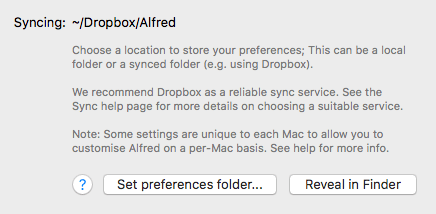

# Nico's dotfiles

Welcome to my world. This is an advanced developed macOS setup.

This setup works perfectly for JavaScript developers and Software Architects who works with macOS.

If this particular setup doesn't work for you, please feel free to borrow some ideas from it.
Pull requests, comments, requests and any other contributions are welcome.


## Contents
+ [Initial Setup and Installation](#initial-setup-and-installation)
+ [Vim and Neovim Setup](#vim-and-neovim-setup)
+ [Alfred 4 Setup](#vim-and-neovim-setup)
+ [Setup ~/.secrets](#setup-secrets)


## Supports
- [Homebrew](https://brew.sh/index_de)
- [Docker](https://www.docker.com/)
- [Node.js](https://nodejs.org/en/)
- [Git](https://git-scm.com/)
- [Mackup](https://github.com/lra/mackup)
- [Vim](https://www.vim.org/) and [NeoVim](https://neovim.io/)
- [Oh-My-ZSH](https://github.com/ohmyzsh/ohmyzsh) or rather ZSH
- Mac Apps
  - [iTerm](https://www.iterm2.com/)
  - [Alfred 4](https://www.alfredapp.com/)

## Initial Setup and Installation

**Warning:** If you want to give these dotfiles a try, you should first fork this repository, review the code, and remove things you don’t want or need. Don’t blindly use my settings unless you know what theory do. Use at your own risk!

You can install the repository by executing the command in terminal:
```bash
sh -c "`curl -fsSL https://raw.githubusercontent.com/snics/dotfiles/master/pre-install.sh`"
```

To run the install wizards please run the command in console:

```bash
sh ~/.dotfiles/install.sh
```

##  Vim and NeoVim Setup
vim and neovim should just work once the correct plugins are installed. To install the plugins, you will need to open Neovim with following command:

```
➜ nvim +PlugInstall
```

##  Alfred 4 Setup
I have also provided my general Alfred 4 settings. You can find them under directory `~/.dotfiles/alfred` there is a file with the name `Alfred.alfredpreferences`. You have to import this file into Alfred, more details can be found at https://www.alfredapp.com/help/advanced/sync/

But here is a small step by step description:
1. Open folder with command `open ~/.dotfiles/alfred`.
2. Open Alfred 4 settings.
3. Go to Advanced.
4. Press button `Set preferences folder...`.



5. Select ~/.dotfiles/alfred directory.
6. Press set.
7. Restart Alfred 4.

## Setup ~/.secrets
In the file `~/.secrets` all secrets are set using a bash command. In the `.secrets.example` inside the root directory of this project you can find examples of what I set with this file. Please replace or add commends to the file, after that you can create the file with the command:
```bash
cp -f ~/.dotfiles/.secrets.example ~/.secrets
```

## TODOs:
- [ ] Add list of aliases
- [ ] Add full list of Mac Apps

## Feedback

Suggestions/improvements
[welcome](https://github.com/snics/dotfiles/issues)!

## Author

| [](http://twitter.com/NicoSwiatecki "Follow @NicoSwiatecki on Twitter") |
|---|
| [Nico Swiatecki](https://swiatecki.io/) |

## Thanks to…
[mathiasbynens](https://github.com/mathiasbynens/dotfiles) - Mathias’s dotfiles
[nicknisi](https://github.com/nicknisi/dotfiles) nicknisi'nicknisi

